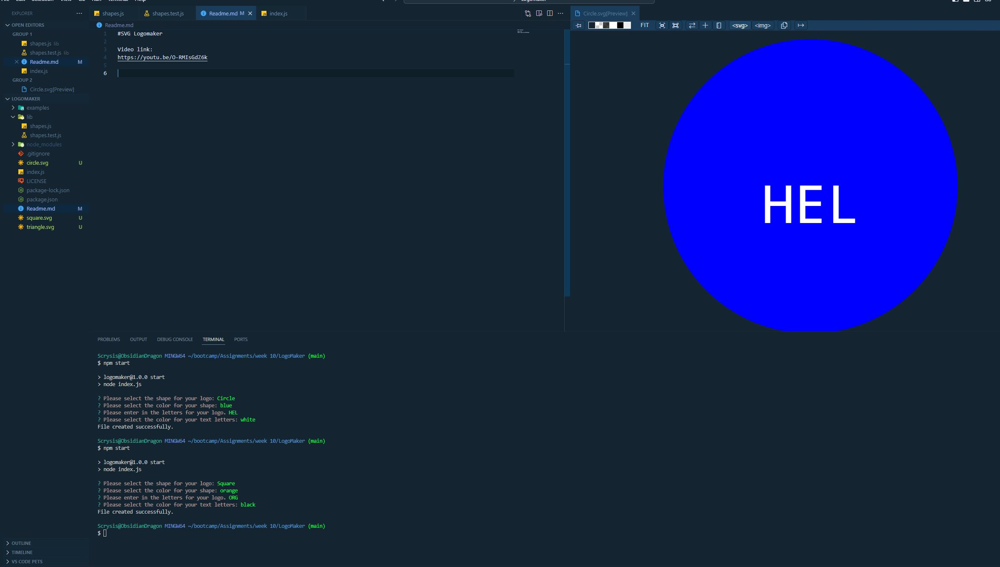

#SVG Logomaker

Video link:
https://youtu.be/O-RMIsGdZ6k

Repository Link:
https://github.com/Scrysis/LogoMaker

Hello!

This project was a study assignment to create a commandline program that would assist in the 
creation of "logo" SVG files and to test the object class used in the program using Jest.

To run the program, be in the main "LogoMaker" folder.  Then type in "npm start" into the terminal.
Follow the prompts as needed, and a file will be generated in the main folder.  Depending on the shape
selected, you will get one of three files: "circle.svg", "triangle.svg", or "square.svg".  You are
advised to remove the file of the corresponding name before making a second file of that same shape
as the program will not overwrite the original file.

To run the Jest testing suite, be in the main "LogoMaker" folder.  Then type in "npm run test".

Issues:

1) Non-centered characters.

    -- I don't know the anchor point on the characters, which is a bit trickier than the anchor points on the 
    shapes that are generated by the program.  That being said, I could have tinkered with it a bit to try and 
    center it a bit more, but decided not to in order to prove that the images being generated are genuine.

2) Jest testing gives a false negative.

    -- I spent NINE HOURS testing and researching this seemingly small problem.  NINE.  I just don't have the 
    time (or energy) to continue on this one problem.  Small adjustments were made in the course of researching this issue
    to the "triangle" portion of this suite.  The core of the problem is that the class function, "render" is not recognized
    as a function when spyOn is used to try and test it, regardless if it returns a value or not.